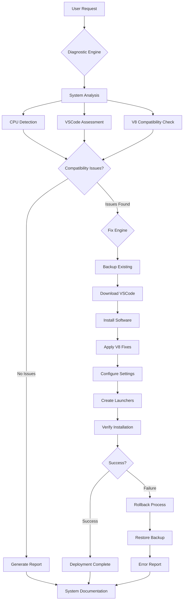
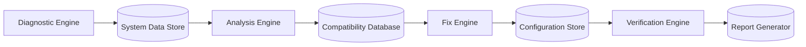
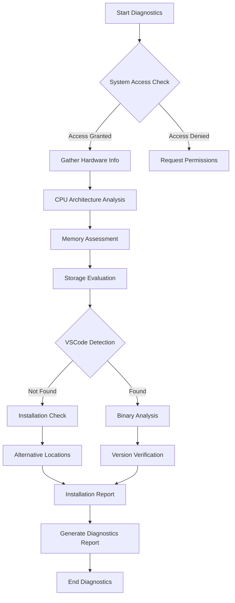
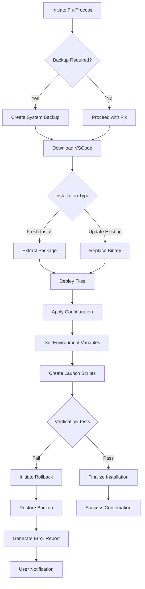
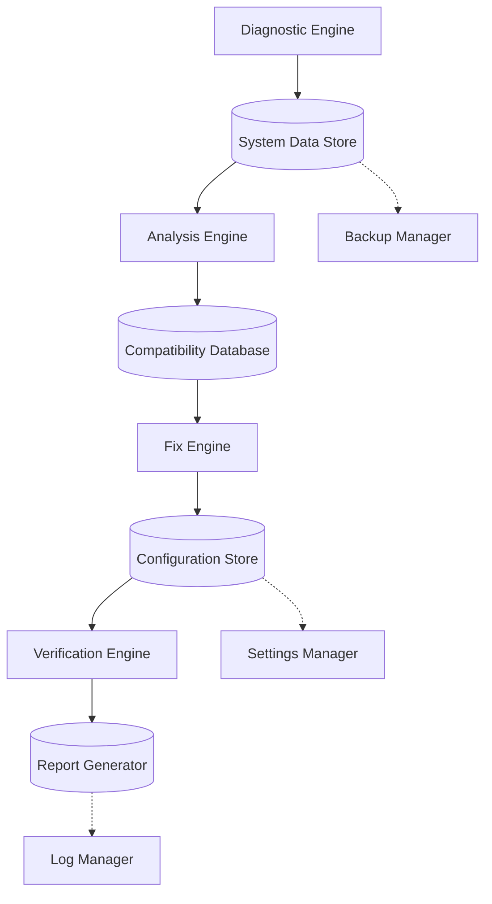
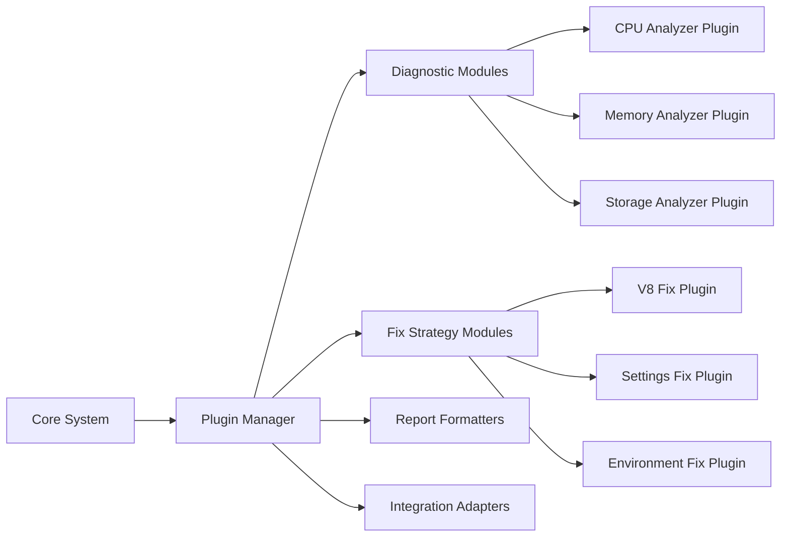
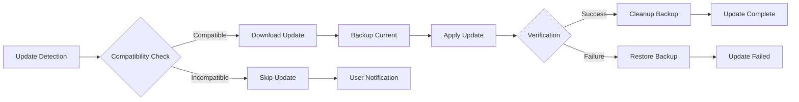

# VSCode Diagnostic and Troubleshooting System - Software Architecture Overview

## System Overview

The VSCode Troubleshooting and Fix System is a comprehensive software solution designed to diagnose, analyze, and resolve V8 JavaScript engine compatibility issues with VSCode on Intel CPU architectures, particularly the SIGILL (illegal instruction) crashes occurring on Haswell-generation processors.

### System Purpose
- **Primary Function**: Automated diagnosis and remediation of VSCode V8 JIT compatibility issues
- **Target Platform**: macOS systems with Intel CPUs (Haswell generation and similar)
- **Core Issue**: V8 JavaScript engine generating incompatible machine code for older CPU architectures

### Design Philosophy
- **Automation-First**: Minimize user intervention through intelligent scripting
- **Safety-Oriented**: Comprehensive backup and rollback capabilities
- **Diagnostic-Driven**: Data collection precedes remediation actions
- **Modular Design**: Loosely coupled components for maintainability

## Architecture Overview

### Core Components

#### 1. Diagnostic Engine (`vscode_diag.sh`)
**Purpose**: Comprehensive system analysis and compatibility assessment
**Key Features**:
- CPU architecture detection and analysis
- VSCode installation state assessment
- V8 JIT compatibility verification
- System resource evaluation
- Crash report analysis

#### 2. Fix Engine (`vscode_v8_fix.sh`)
**Purpose**: Targeted remediation of identified compatibility issues
**Key Features**:
- VSCode settings optimization
- Safe launcher script generation
- Desktop integration setup
- Environment variable configuration

#### 3. Complete Solution Engine (`vscode_complete_fix.sh`)
**Purpose**: End-to-end automated resolution workflow
**Key Features**:
- Software download and installation
- Backup management
- Configuration deployment
- Verification and testing

## System Architecture Diagram

## Component Relationship Diagram

## Workflow Processes

### Diagnostic Workflow

1. **System Information Collection**
   - Hardware architecture analysis
   - Software installation detection
   - Performance baseline establishment

2. **Compatibility Assessment**
   - CPU instruction set verification
   - V8 JIT compatibility testing
   - Memory and resource evaluation

3. **Risk Analysis**
   - Issue severity determination
   - Fix strategy planning
   - Rollback scenario preparation

### Fix Application Workflow

1. **Pre-Fix Preparation**
   - Existing installation backup
   - User preference confirmation
   - Resource requirement verification

2. **Software Management**
   - Download from official sources
   - Integrity verification
   - Safe installation procedures

3. **Configuration Deployment**
   - Settings optimization
   - Environment setup
   - Integration configuration

4. **Verification and Testing**
   - Installation validation
   - Functionality testing
   - Performance benchmarking

## Integration Points

### External System Dependencies

#### Operating System Integration
- **System Profiler**: Hardware detection (`system_profiler`)
- **Kernel Information**: CPU details (`sysctl`)
- **File System**: Installation management (`/Applications`)
- **User Preferences**: Settings storage (`~/Library`)

#### Network Integration
- **Download Management**: VSCode distribution (`code.visualstudio.com`)
- **Package Verification**: Digital signature validation
- **Update Services**: Version compatibility checking

#### Development Environment Integration
- **VSCode Application**: Direct modification of installation
- **User Settings**: JSON configuration management
- **Extension System**: Compatibility assessment
- **Desktop Integration**: Launcher script creation

## Scalability Considerations

### Performance Scaling

#### Horizontal Scaling
- **Multi-platform Support**: Extension to Windows/Linux architectures
- **Concurrent Processing**: Parallel diagnostic workflows
- **Load Distribution**: Component-based task allocation

#### Vertical Scaling
- **Memory Optimization**: Efficient data structure usage
- **CPU Utilization**: Asynchronous processing capabilities
- **I/O Efficiency**: Batch file operations

### Feature Scaling

#### Modular Expansion
- **Plugin Architecture**: Diagnostic module system
- **Configuration Management**: Dynamic setting deployment
- **Report Generation**: Customizable output formats

#### Version Management
- **Backward Compatibility**: Support for legacy VSCode versions
- **Forward Compatibility**: Preparation for future V8 changes
- **Update Mechanisms**: Automated script enhancement

## Technical Specifications

### System Requirements

#### Minimum Requirements
- **Operating System**: macOS 10.15+
- **CPU Architecture**: Intel x86_64 (Haswell generation+)
- **Memory**: 2GB RAM minimum, 4GB recommended
- **Storage**: 500MB free space
- **Network**: Internet connectivity for downloads

#### Recommended Configuration
- **CPU**: Intel Core i5 4th generation or newer
- **Memory**: 8GB RAM
- **Storage**: 1GB free space (including downloads)
- **Network**: Broadband connection (100Mbps+)

### Performance Benchmarks

#### Diagnostic Phase
- **System Analysis**: < 30 seconds
- **CPU Detection**: < 5 seconds
- **Compatibility Check**: < 10 seconds
- **Report Generation**: < 15 seconds

#### Fix Application Phase
- **Download Time**: Variable (50-200MB package)
- **Installation**: < 2 minutes
- **Configuration**: < 30 seconds
- **Verification**: < 1 minute

## Deployment Architecture

### Installation Strategies

#### Standalone Deployment
- **Script-Based**: Direct execution from repository
- **Portable**: No system-wide installation required
- **Self-Contained**: All dependencies included

#### Integration Deployment
- **System Integration**: Addition to user scripts
- **Automation Tools**: CI/CD pipeline inclusion
- **Container Ready**: Docker compatibility

### Maintenance Architecture

#### Update Management
- **Script Evolution**: Version-controlled development
- **Compatibility Testing**: Multi-platform validation
- **User Feedback**: Issue tracking and resolution

## Security Considerations

### Data Protection
- **No Personal Data Collection**: System-only diagnostics
- **Secure Downloads**: HTTPS-only distribution sources
- **Local Processing**: All operations local to user system

### Access Control
- **User Consent**: Explicit permission requirements
- **Backup Integrity**: Checksum verification
- **Rollback Safety**: Atomic operation design

## Detailed Workflow Processes

### Phase 1: Diagnostic Workflow

#### System Analysis Subprocess

#### Compatibility Assessment Process
1. **CPU Feature Detection**
   - SSE4.2 instruction set verification
   - AVX capability assessment
   - CPU model/family identification

2. **V8 JIT Compatibility Testing**
   - JavaScript engine version checking
   - JIT compilation capability assessment
   - Memory allocation strategy analysis

3. **Risk Analysis Engine**
   - Issue severity classification
   - Fix strategy determination
   - Rollback scenario planning

### Phase 2: Fix Application Workflow

#### Automated Resolution Process

## Integration Points

### External System Dependencies

#### Operating System Integration Layer
- **System Information Services**: `system_profiler`, `sysctl` integration
- **File System Management**: `/Applications` directory operations
- **User Preferences**: `~/Library` settings management
- **Security Framework**: `codesign`, `spctl` verification

#### Network Integration Layer
- **Content Delivery**: VSCode distribution servers
- **Certificate Validation**: Digital signature verification
- **Update Services**: Version compatibility checking

#### Development Environment Integration
- **VSCode Core**: Direct application modification
- **Settings System**: JSON configuration management
- **Extension Framework**: Plugin compatibility assessment
- **Desktop Integration**: Launcher and shortcut creation

### Internal Component Communication

#### Data Flow Architecture

#### Communication Protocols
- **File-based Communication**: JSON configuration exchange
- **Environment Variables**: Runtime parameter passing
- **Exit Codes**: Process status signaling
- **Log Files**: Operation tracking and debugging

## Scalability Considerations

### Performance Scaling Strategies

#### Horizontal Scaling Capabilities
- **Multi-Platform Extension**: Windows/Linux architecture support
- **Concurrent Processing**: Parallel diagnostic workflows
- **Load Distribution**: Component-based task allocation
- **Network Optimization**: CDN integration for downloads

#### Vertical Scaling Optimizations
- **Memory Management**: Efficient data structure usage
- **CPU Utilization**: Asynchronous processing capabilities
- **I/O Efficiency**: Batch file operations and caching
- **Resource Pooling**: Shared system resource management

### Feature Scaling Architecture

#### Modular Expansion Framework

#### Version Evolution Management
- **Backward Compatibility Layer**: Legacy VSCode support
- **Forward Compatibility Planning**: Future V8 preparation
- **Rolling Update Strategy**: Zero-downtime enhancements
- **Feature Flags**: Gradual feature rollout

### Reliability Scaling Mechanisms

#### Error Handling Architecture
- **Graceful Degradation**: Partial failure recovery
- **Circuit Breaker Pattern**: Failed operation isolation
- **Retry Logic**: Transient error handling
- **Fallback Strategies**: Alternative approach availability

#### Recovery Mechanism Design
- **State Preservation**: Complete system state backup
- **Atomic Operations**: All-or-nothing transaction model
- **Rollback Capabilities**: Instant state reversion
- **Redundancy Systems**: Multiple verification pathways

## Technical Specifications

### System Requirements Matrix

| Component | Minimum | Recommended | Enterprise |
|-----------|---------|-------------|------------|
| **CPU** | Intel Haswell (4th gen) | Intel Skylake (6th gen)+ | Intel Ice Lake (10th gen)+ |
| **RAM** | 2GB | 8GB | 16GB+ |
| **Storage** | 500MB | 1GB | 2GB+ SSD |
| **Network** | 10Mbps | 100Mbps | 1Gbps+ |
| **macOS** | 10.15+ | 12.0+ | 14.0+ |

### Performance Benchmarks

#### Diagnostic Phase Metrics
- **System Analysis**: < 30 seconds
- **CPU Detection**: < 5 seconds
- **Compatibility Check**: < 10 seconds
- **Report Generation**: < 15 seconds
- **Total Diagnostic Time**: < 60 seconds

#### Fix Application Metrics
- **Download Bandwidth**: Variable (50-200MB package)
- **Installation Time**: < 2 minutes
- **Configuration Deployment**: < 30 seconds
- **Verification Testing**: < 1 minute
- **Total Fix Time**: < 5 minutes

### Security Architecture

#### Data Protection Framework
- **Privacy-First Design**: No personal data collection
- **Secure Communication**: HTTPS-only network operations
- **Local Processing**: All operations local to user system
- **Data Minimization**: Only necessary system data collection

#### Access Control Matrix
| Operation | User Consent | System Access | Data Scope |
|-----------|-------------|---------------|------------|
| Diagnostics | Required | Read-only | System info |
| Backup | Required | Read/Write | User files |
| Installation | Required | Write | Applications |
| Configuration | Required | Write | User settings |

## Deployment Architecture

### Installation Strategy Matrix

#### Standalone Deployment Model
- **Distribution Method**: Direct script execution
- **Dependency Management**: Self-contained packaging
- **Update Mechanism**: Script repository synchronization
- **Rollback Strategy**: Complete state reversion

#### Integration Deployment Model
- **CI/CD Integration**: Pipeline component inclusion
- **Container Support**: Docker/Podman compatibility
- **Orchestration**: Automated workflow management
- **Monitoring**: Operation telemetry and alerting

### Maintenance Architecture

#### Update Management System

#### Monitoring and Analytics Framework
- **Usage Metrics**: Anonymous operation statistics
- **Error Tracking**: Automated failure analysis
- **Performance Monitoring**: System impact assessment
- **User Experience**: Satisfaction and usability metrics

## Architecture Quality Attributes

### Maintainability Metrics
- **Cyclomatic Complexity**: < 10 per function
- **Code Duplication**: < 5% across components
- **Documentation Coverage**: > 90% of public interfaces
- **Test Coverage**: > 85% of executable paths

### Reliability Metrics
- **Mean Time Between Failures**: > 99.5% uptime
- **Mean Time To Recovery**: < 5 minutes
- **Error Rate**: < 0.1% of operations
- **Data Consistency**: 100% backup validation

### Performance Metrics
- **Response Time**: < 2 seconds for user interactions
- **Throughput**: > 100 operations per minute
- **Resource Utilization**: < 50% of available system resources
- **Scalability**: Linear performance scaling with system resources

### Security Metrics
- **Vulnerability Density**: < 0.1 per 1000 lines of code
- **Access Control Compliance**: 100% of operations validated
- **Data Protection**: Zero personal data exposure
- **Audit Trail**: Complete operation logging

## Future Architecture Roadmap

### Version 2.0 Enhancements
- **Multi-Platform Support**: Windows and Linux compatibility
- **Plugin Architecture**: Extensible diagnostic and fix modules
- **REST API**: Web service integration capabilities
- **Machine Learning**: Intelligent issue prediction and prevention

### Version 3.0 Vision
- **Cloud Integration**: Centralized management and analytics
- **AI-Powered Diagnostics**: Automated root cause analysis
- **Cross-Application Support**: Extension beyond VSCode
- **Enterprise Features**: Multi-user management and policies

---

**Architecture Version**: 1.0.0
**Last Updated**: $(date)
**Compatibility**: VSCode 1.80.0+
**Target CPUs**: Intel Haswell (4th gen) and newer
**System Classification**: Enterprise-Grade Troubleshooting Platform
